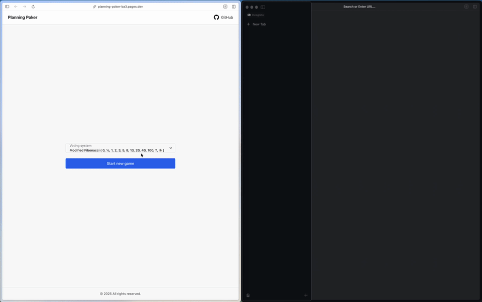

# Planning Poker

[](https://codecov.io/github/rie03p/planning-poker)



A real-time Planning Poker web application for agile teams.  
Estimate story points collaboratively with live synchronization.

## Features

- **Real-time collaboration** via WebSockets
- **Multiple estimation scales**
  - Fibonacci
  - Modified Fibonacci
  - T-Shirt sizes
  - Powers of 2
- **Reveal / Reset** voting rounds
- **Sharable game links**
- **Persistent state** using Cloudflare Durable Objects

## Tech Stack

- **Frontend**: React, Vite, Chakra UI
- **Backend**: Cloudflare Workers, Durable Objects, WebSockets
- **Shared**: TypeScript, Zod
- **Testing**: Vitest
- **Package Manager**: pnpm

## Getting Started

### Prerequisites

- Node.js v18+
- pnpm
- (Optional) Docker
- Wrangler CLI

### Install

1. Clone the repository:
```bash
git clone https://github.com/rie03p/planning-poker.git
cd planning-poker
```

2. Install dependencies:
```bash
pnpm install
```

### Development

#### Option 1: Using Docker Compose

Start the frontend development server:
```bash
docker compose up
```

The frontend will be available at `http://localhost:5173`

In a separate terminal, start the backend:
```bash
cd wrangler
pnpm dev
```

The backend will be available at `http://localhost:8787`

#### Option 2: Direct Local Development

1. Start the backend server:
```bash
cd wrangler
pnpm dev
```

2. In a separate terminal, start the frontend:
```bash
cd frontend
pnpm dev
```

### Environment Configuration

Create a `.env` file in the `frontend` directory:
```env
VITE_BACKEND_URL=http://localhost:8787
```

For production, update this to your deployed Cloudflare Workers URL.

## Deployment

### Frontend

Build the frontend:
```bash
cd frontend
pnpm build
```

Deploy the `dist` folder to your preferred hosting service (Cloudflare Pages, Vercel, Netlify, etc.)

### Backend

Deploy to Cloudflare Workers:
```bash
cd wrangler
pnpm deploy
```

Make sure you have configured your Cloudflare account with Wrangler:
```bash
wrangler login
```

## Testing

Run tests with coverage:
```bash
pnpm test:coverage
```

## License

MIT

